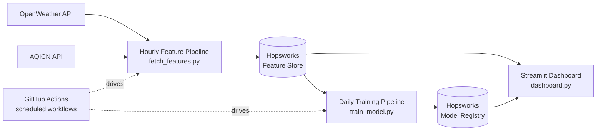

# Karachi AQI Forecasting Pipeline

An end-to-end, cloud-based MLOps pipeline that forecasts Air Quality Index
(AQI) for Karachi, Pakistan at 24h, 48h, and 72h horizons. Data ingestion,
feature storage, model training, and serving all run on scheduled/managed
cloud infrastructure — nothing depends on a local machine staying on.

## Live

- **Dashboard:** https://aqi-forecasting-pipeline-terajypncqwythb8qkwpwf.streamlit.app/
- **Feature Store & Model Registry:** [Hopsworks Serverless](https://www.hopsworks.ai/) —
  feature group `aqi_karachi_features` (v4) and models `aqi_forecast_24h` /
  `aqi_forecast_48h` / `aqi_forecast_72h`.

## Architecture



- `fetch_features.py` runs hourly, pulls current pollutant readings from
  OpenWeather (AQICN is a cross-check/staleness signal only), computes the
  real EPA AQI, and writes into the Feature Store. It also reconciles any
  gap since the last successfully-recorded hour before writing the new row
  (see [Automation](#automation)).
- `train_model.py` runs daily, reads the feature group, retrains all three
  horizons, and registers the best model per horizon.
- `dashboard.py` reads the latest features and models straight from
  Hopsworks on every page load — it holds no local model or data files.

## Repository layout

| Path | What it is |
|---|---|
| `dashboard.py` | Streamlit app (deployment entry point — do not move) |
| `fetch_features.py` | Hourly pipeline: fetch + self-heal + write one live row |
| `train_model.py` | Daily pipeline: train and register all 3 horizons |
| `compute_true_aqi.py` | EPA AQI breakpoint formula + rolling-window calc (shared) |
| `backfill_historical.py` | One-shot ~2yr historical pull from OpenWeather's History API |
| `backfill_gap.py` | Manual/one-off gap backfill; also imported by `fetch_features.py` for its per-run self-healing logic |
| `ingest_to_hopsworks.py` | Loads the historical backfill CSV into the Feature Store (one-time setup) |
| `setup_feature_view.py` | Creates the Hopsworks Feature View used for training reads |
| `aqi_alerts.py` | EPA-category hazard-alert threshold logic, shared by the dashboard |
| `requirements.txt` | Runtime dependencies (what Streamlit Cloud and both workflows install) |
| `scripts/` | Diagnostics and one-off maintenance scripts (not part of the scheduled pipelines) |
| `eda/` | Historical exploratory data analysis scripts and their saved plots |
| `.github/workflows/` | The two scheduled GitHub Actions pipelines |
| `trained_models/` | Local training output (git-ignored — models live in the Model Registry) |

## Setup

Requires **Python 3.11** — this matches both CI workflows and the Python
version the currently-registered models were pickled under; other versions
may fail to unpickle them.

```bash
pip install -r requirements.txt
```

Environment variables required:

| Variable | Used by | Configured in |
|---|---|---|
| `HOPSWORKS_API_KEY` | every script that touches the Feature Store/Model Registry | GitHub Actions secrets, Streamlit Cloud secrets, Codespaces secrets |
| `OPENWEATHER_API_KEY` | `fetch_features.py`, `backfill_historical.py`, `backfill_gap.py` | GitHub Actions secrets, Codespaces secrets |
| `AQICN_API_TOKEN` | `fetch_features.py` (optional — cross-check only) | GitHub Actions secrets, Codespaces secrets |

Never commit actual key values; the scripts read them from the environment
only.

## Running each piece

In the order a new setup would need them:

```bash
# 1. One-time historical backfill (~2 years from OpenWeather's History API)
python backfill_historical.py

# 2. Compute the real EPA AQI target column on top of the backfill
python compute_true_aqi.py

# 3. Load the backfill into the Hopsworks Feature Store
python ingest_to_hopsworks.py

# 4. Create the Feature View training reads from
python setup_feature_view.py

# 5. Train and register all 3 horizon models
python train_model.py

# 6. Run the dashboard locally
streamlit run dashboard.py

# Diagnostics / one-off maintenance, as needed
python scripts/diagnose_staleness.py
python scripts/check_data_quality.py
python backfill_gap.py   # manual gap-fill; the hourly pipeline now self-heals routine gaps
```

## Automation

Two scheduled GitHub Actions workflows, both triggerable manually from the
**Actions** tab (`workflow_dispatch`):

| Workflow | File | Schedule | What it runs |
|---|---|---|---|
| Hourly Feature Pipeline | `.github/workflows/feature_pipeline.yml` | `17 * * * *` (hourly, UTC) | `fetch_features.py` |
| Daily Training Pipeline | `.github/workflows/training_pipeline.yml` | `0 3 * * *` (03:00 UTC daily) | `train_model.py` |

The feature pipeline reconciles any missed hours (GitHub Actions scheduled
runs are best-effort and can be silently dropped) before writing the
current hour, capped at 168 hours of healing per run so an extended outage
can't turn one scheduled run into an unbounded job.

## Results

Held-out test set, chronological split (most recent 20% of data), current
registered models — all three are Random Forest:

| Horizon | RMSE | MAE | R² |
|---|---|---|---|
| 24h | 11.79 | 6.65 | 0.72 |
| 48h | 17.40 | 11.87 | 0.36 |
| 72h | 20.49 | 15.02 | 0.16 |

The 24h model is a genuinely useful forecaster. The 48h model is weaker
but still informative. The 72h model beats the naive persistence baseline
("AQI in 72h = AQI right now") only marginally — real signal, not noise,
but it should be read as a directional hint rather than a reliable
forecast. The dashboard visually de-emphasizes the 72h forecast
accordingly.

# 📊 Project Overview
You can read the full documentation here: **[Download the AQI Forecasting Final Report (PDF)](./AQI_Forecasting_Final_Report.pdf)**
